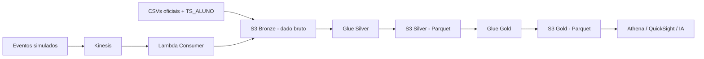

# Tech Challenge – Fase 2
## Pipeline híbrido para análise da alfabetização no Brasil

Este projeto foi feito para o Tech Challenge da Fase 2. A ideia principal foi montar uma pipeline de dados em nuvem usando a arquitetura medalhão, com as camadas Bronze, Silver e Gold.

O tema do projeto é o Indicador Criança Alfabetizada, que mede o percentual de estudantes considerados alfabetizados a partir do ponto de corte de 743 pontos na proficiência de Língua Portuguesa.

Separei o projeto pensando em uma situação parecida com uma área de dados de uma organização pública: primeiro guardo os dados brutos, depois trato e padronizo, e por fim deixo tabelas analíticas para consulta no Athena, dashboard ou algum modelo de machine learning.

---

## Contexto do problema

A alfabetização até o final do 2º ano do ensino fundamental é uma das metas educacionais do Brasil. Só olhar o número nacional não é suficiente, porque o resultado pode mudar bastante por UF, município e rede de ensino.

Por isso, o pipeline integra algumas bases diferentes:

- Meta nacional de alfabetização;
- Meta por UF;
- Meta por município;
- Indicador agregado por UF;
- Indicador agregado por município;
- Microdados de alunos.

O objetivo final é conseguir comparar resultado x meta e também ter uma visão calculada a partir dos microdados.

---

## Arquitetura proposta

A solução usa AWS, principalmente porque S3 + Athena é um caminho simples e barato para esse tipo de projeto. Como os dados oficiais não mudam em tempo real a todo momento, não fazia sentido montar uma arquitetura muito pesada.

Mesmo assim, deixei uma parte de streaming simulada com Kinesis e Lambda, porque o desafio pede uma pipeline híbrida. Nesse caso, os eventos representam possíveis atualizações futuras de indicadores.



---

## Como pensei as camadas

### Bronze

A Bronze recebe os CSVs praticamente do jeito que vieram. A ideia aqui é preservar o dado original para rastreabilidade.

Exemplo:

```text
DADOS/*.csv -> S3 bronze/inep/alfabetizacao/
```

### Silver

Na Silver eu faço os tratamentos que achei necessários antes de montar análises:

- padronização de nomes de colunas;
- conversão de tipos;
- leitura correta do `TS_ALUNO.csv`, que usa `;` como separador;
- criação da coluna `rede_descricao`, porque algumas tabelas usam rede numérica e outras usam texto;
- cálculo da flag de alfabetização pelo corte de 743 pontos.

### Gold

Na Gold eu deixo tabelas mais prontas para análise:

- indicador por município;
- indicador por UF;
- indicador nacional;
- visão agregada dos microdados por município.

Essas tabelas são salvas em Parquet e particionadas por ano.

---

## Tecnologias utilizadas

- **AWS S3**: armazenamento das camadas Bronze, Silver e Gold.
- **AWS Glue com PySpark**: transformação dos dados.
- **AWS Athena / Trino**: consulta SQL em cima da camada Gold.
- **Kinesis + Lambda**: simulação da parte streaming.
- **Terraform**: criação básica de infraestrutura.
- **Parquet + Snappy**: redução de custo de leitura no Athena.

Optei por Athena porque ele consulta direto o S3 e não exige cluster ligado o tempo todo. Para um projeto com bases públicas e cargas batch, isso faz mais sentido em custo.

---

## Fluxo dos arquivos

```text
scripts/config.py
scripts/upload_to_bronze.py
    ↓
S3 Bronze
    ↓
glue/jobs/silver_transform.py
    ↓
S3 Silver
    ↓
glue/jobs/data_quality.py
    ↓
glue/jobs/gold_transform.py
    ↓
S3 Gold
    ↓
sql/athena/*.sql
```

A parte de streaming fica separada:

```text
lambda/stream_producer.py -> Kinesis -> lambda/stream_consumer.py -> S3 Bronze
```

---

## Decisões arquiteturais

### Batch x Streaming

Usei batch para as bases oficiais porque elas são históricas e estruturadas. A parte streaming ficou como simulação, porque não existe uma API pública em tempo real para esse indicador.

### Data Lake x Data Warehouse

Escolhi Data Lake em S3 porque é mais barato e simples para armazenar dados brutos e tratados. O Athena entra como camada de consulta, evitando ter que manter um data warehouse ligado.

### Custo x Performance

Eu não tentei fazer a arquitetura mais performática possível, porque isso poderia deixar o projeto caro e mais complexo do que o necessário. A principal otimização foi usar Parquet, compressão Snappy e particionamento por ano.

---

## Qualidade de dados

No job `data_quality.py`, criei validações simples para conferir:

- duplicidade de aluno;
- percentuais fora do intervalo de 0 a 100;
- proficiência negativa;
- aderência ao corte de 743 pontos;
- municípios dos microdados sem referência histórica;
- existência da coluna `rede_descricao`.

Algumas validações não bloqueiam de primeira, porque as bases não têm exatamente a mesma cobertura e ano. Preferi notificar quando o problema é pequeno, em vez de quebrar o pipeline sem necessidade.

---

## Monitoramento

O monitoramento foi pensado de forma simples:

- acompanhar execução dos Glue Jobs;
- olhar logs no CloudWatch;
- validar se os arquivos foram criados no S3;
- executar o job de qualidade antes de usar a Gold;
- rodar `MSCK REPAIR TABLE` no Athena para reconhecer partições.

---

## FinOps

As principais decisões de custo foram:

- manter CSV apenas na Bronze;
- converter Silver e Gold para Parquet;
- usar compressão Snappy;
- particionar por ano;
- usar Glue sob demanda;
- consultar pelo Athena, pagando conforme leitura.

Como o Athena cobra por volume lido, evitar `SELECT *` e usar filtros por ano ajuda bastante.

---

## Limitações

- O streaming é uma simulação, não uma fonte real em tempo real.
- O Terraform cria a base da infraestrutura, mas não automatiza 100% dos Glue Jobs e Lambdas.
- As tabelas de resultado e meta usam formatos diferentes para a coluna `rede`, então precisei criar uma padronização na Silver.
- Os microdados de alunos podem ter ano diferente dos dados agregados de município e UF.

---

## Uso futuro em IA

A camada Gold poderia ser usada para:

- prever taxa de alfabetização por município;
- identificar municípios com maior distância da meta;
- analisar desigualdade por UF e rede de ensino;
- criar clusters de municípios com perfil parecido;
- apoiar políticas públicas baseadas em dados.
